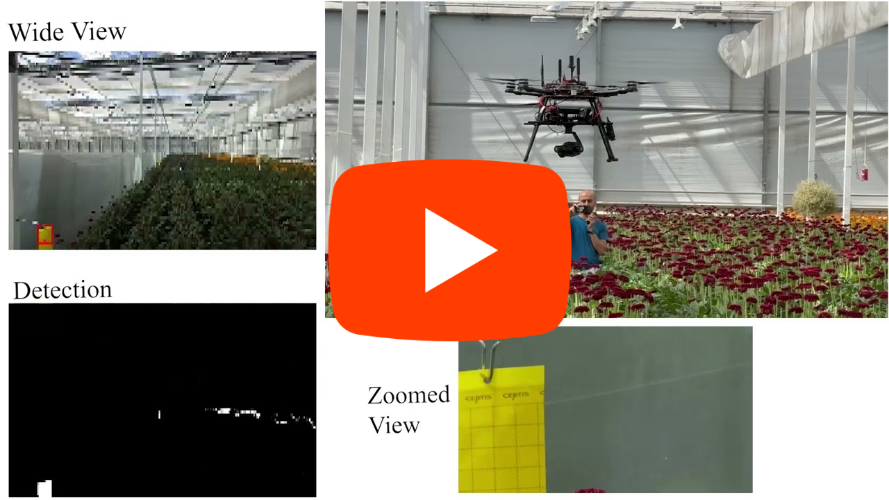
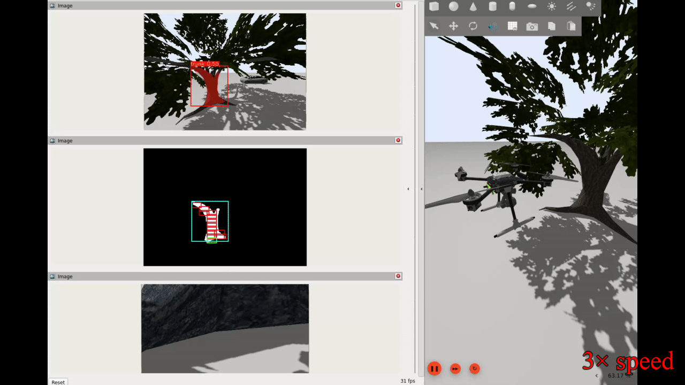

# Aerial Micro Inspection

Inspecting surfaces for tiny targets is challenging, especially with an aerial robot that is constantly moving, vibrating, and changing viewpoint. This package provides a dual-camera solution, following a coarse to fine approach. It combines a wide-FOV navigation camera with a zoomed camera mounted on a gimbal (inspection camera) so that drones can automatically perform micro-detection workflows during the flight. The package is modular, such that adapting the system to a new application, you only need to intsert two trained checkpoints into the pipeline. At the moment we only have implemented YOLO family detection/segmentation models. One segmentation model is needed for surface segmentation and one detection model for tiny-subject detection. Current implementation is interfaced with PX4-Autopilot software stack.

[](https://www.youtube.com/watch?v=biAapcSxhtY)

# Setting up simulation

The most simple installation is through docker using the docker file at `aerial_micro_inspection/Dockerfile`.

## 1. Build docker image (Ubuntu 22.04 + ROS 2 Humble + Gazebo Harmonic)

Build from the workspace `src` directory:

```bash
cd ~ && mkdir scanner_ws && cd ~/scanner_ws/src
docker build -f aerial_micro_inspection/Dockerfile -t aerial_micro_inspection:humble .
```
## 2. Run container with Gazebo GUI (Linux/X11)

Make sure NVIDIA Container Toolkit is installed on host, then run with GPU access:

```bash
xhost +local:docker

docker run --rm -it \
	--gpus all \
	--net=host \
	-e DISPLAY=$DISPLAY \
	-e QT_X11_NO_MITSHM=1 \
	-e XAUTHORITY=$XAUTHORITY \
	--device=/dev/dri:/dev/dri \
	-v /tmp/.X11-unix:/tmp/.X11-unix:rw \
	-v $XAUTHORITY:$XAUTHORITY:ro \
	-v ~/scanner_ws/src:/ws/src:rw \
	aerial_micro_inspection:humble
```

## 3. Build workspace manually inside container

```bash
cd /ws
colcon build --symlink-install
source install/setup.bash
```

## 4. Run simulation

Launch full PX4 simulation:

```bash
ros2 launch aerial_micro_inspection tree_car_px4.launch.py
```

> [!NOTE]
> 1. You should open QGroundControl in a separate terminal to enable the offboard mission control.
> 2. In case you encounter errors such as `libOpticalFlowSystem.so`, `libGstCameraSystem.so`, or `MotorFailurePlugin` are missing, you can ignore them.
> 3. In order for the default pipeline to work, you need to place some YOLO checkpoints related to the default mission (EPR) in the `aerial_mircro_inspection/weights` directory. You can find them in the following link:
>  https://drive.google.com/file/d/1DVNta4nifv4AS4VwWwGPogL-U68__rrm/view?usp=sharing

To launch the dual-camera inspection pipeline, in a separate terminal, run:

```bash
ros2 launch aerial_micro_inspection scanner.launch.py mission_config_file:=/ws/src/aerial_micro_inspection/config/simulation/mission.yaml det_mode:='ai'
```

To visualize:

```bash
rviz2 -d /ws/src/aerial_micro_inspection/config/rviz_config.rviz
```

Expected outcome in use case of tree trunk inspection to detect caterpillar eggs:



# Setting up on Jetson Orin Nano

## 1. Installation
For Jetson Orin Nano with Ubuntu 22.04, JetPack 6, and L4T 36.3, follow the [installation guide](docs/installation.md).

After completing the installation steps there, run the real stack with:

```bash
ros2 launch aerial_micro_inspection scanner_zed.launch.py mission_config_file:=~/scanner_ws/src/aerial_micro_inspection/config/real_test/mission.yaml
	det_mode:=ai
```

To visualize:

```bash
rviz2 -d ~/scanner_ws/src/aerial_micro_inspection/config/rviz_config.rviz
```


## 2. Calibrarion
To be added.

## 3. Experiment


# Customization

This pipeline is designed to be adapted primarily by swapping model checkpoints and a small set of model-related config parameters, without changing node logic. The two models are needed are: (1) **Surface segmentation model** (2) **Micro detection model**. For surface segmentation, provide a YOLO segmentation checkpoint (`.pt`) in `surface_segmentation.path` (with `confidence_threshold` and `iou_threshold`); for micro target detection, provide a YOLO detection checkpoint (`.pt`) in `micro_detection.path` (with its own confidence/IoU thresholds). The expected model family is Ultralytics YOLO models compatible with the `ultralytics` runtime API, and the code is structured for that interface; however, in this project we have only validated behavior with YOLOv11 (surface segmentation) and YOLOv10/YOLOv11-style detection checkpoints.

The default model we used for testing, was for tree trunk inspection to detect catterpillar nests. For instance, if we want to modify the pipeline for the use case of car's body inspection, we will use the pretrained [YOLO11s-seg model](https://docs.ultralytics.com/models/yolo11/#segmentation-coco), download it and place it in the weights folder. Then, we modify the config file, specifically the following section:

```yaml
surface_segmentation:
  confidence_threshold: 0.27                                          
  iou_threshold: 0.3 
  target_class_id: 2   # Change to the class id of car in COCO dataset (all other detected classes of the following model will be ignored)
  path: "/ws/src/aerial_micro_inspection/weights/yolo11s-seg.pt"  # Change to the newly downloaded model
```

In case we have a trained model for the micro detection (for instance, a model for detecting any scraches) we can similarly place it in weights folder and adjust the model path in config file:

```yaml
micro_detection:
  path: "/ws/src/aerial_micro_inspection/weights/yolov10n_eggs.pt" 
  confidence_threshold: 0.05
  iou_threshold: 0.1
```

We can verify car inspection in simulation:

```bash
ros2 launch aerial_micro_inspection tree_car_px4.launch.py target_waypoint_x:=8.0 target_waypoint_y:=-12.0 target_waypoint_z:=-1.5
```

In a separate terminal:

```bash
ros2 launch aerial_micro_inspection scanner.launch.py mission_config_file:=/ws/src/aerial_micro_inspection/config/simulation/mission.yaml det_mode:='ai'
```

To visualize:

```bash
rviz2 -d /ws/src/aerial_micro_inspection/config/rviz_config.rviz
```

Expected outcome:


